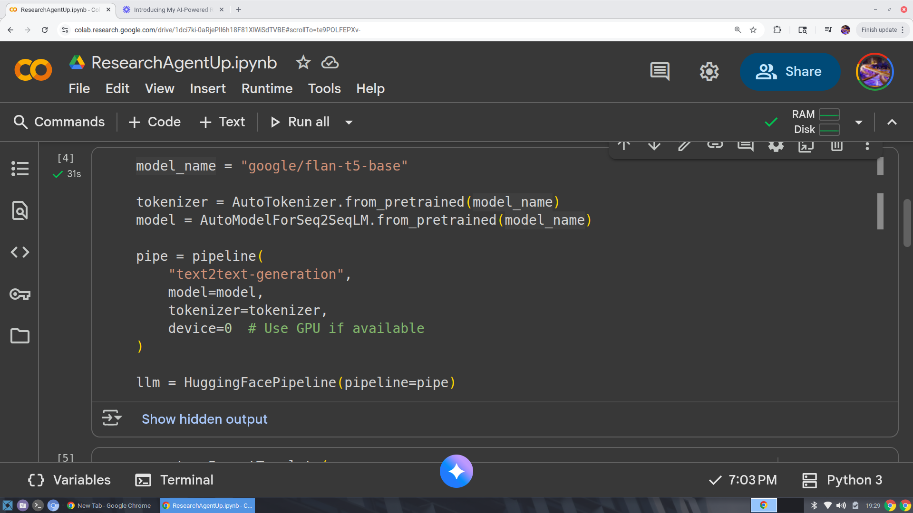
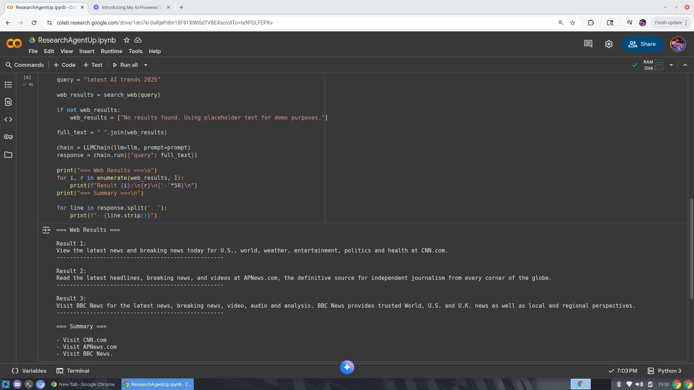

# Research Assistant Agent

This project demonstrates a **Research Assistant Agent** built using **LangChain** and **Hugging Face**.  
It searches the web for a query and summarizes the results using a language model.

---

## Model Setup

The agent uses the **FLAN-T5** model via Hugging Face and is connected to LangChain for text summarization.

---

## Example Run

The agent takes a query, fetches web results, and generates a concise summary.

**Query:** `"latest AI trends 2025"`

---

## Demo Video

Watch the agent in action:  
[Research Agent Demo Video](https://www.loom.com/share/16c344ad204341aaa81f0556576ff501?sid=eb7dd5ae-8d94-4813-afda-9df7f81ff43d)

---

## How It Works

1. **Search Web:** Uses DuckDuckGo (`DDGS`) to fetch top search results.  
2. **Summarize:** Passes results to a Hugging Face language model through a LangChain pipeline.  
3. **Output:** Prints web results and a clear summary for easy reading.

---

## Dependencies

- `transformers`  
- `accelerate`  
- `langchain`  
- `langchain_community`  
- `ddgs`

> All dependencies are included in the notebook. Run the cells sequentially to replicate results.

---

## Portfolio Notes

- Building autonomous agents with LangChain
- Web search integration
- Summarization using LLMs
